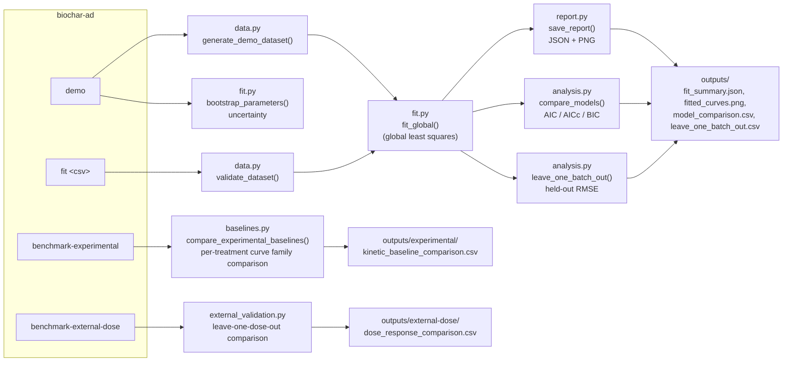

# Architecture and glossary

This page is the map. If the rest of the repository assumes you already know what BMP,
AD, or a Gompertz curve are, start here — it is written for a bachelor-level reader with
no prior background in anaerobic digestion or kinetic modelling.

## The idea in plain language

Anaerobic digestion (AD) is a process where microorganisms break down organic waste
without oxygen and produce biogas, mostly methane (CH₄). A **biomethane potential (BMP)
test** measures how much methane a specific waste sample produces over time, in a small
sealed reactor ("batch"), usually over a few weeks.

Some studies add **biochar** — a charcoal-like material made by heating biomass without
much oxygen — to the reactor, hoping it improves digestion (faster, or more methane, or
both). The trouble is that a reported improvement could come from the biochar itself, or
from something else entirely: which microbial community ("inoculum") was used, the
temperature, the dose, or the reactor. Most papers report only one number per treatment
(the total methane produced), which cannot separate these effects.

This repository is a **reproducible modelling workflow**: it fits a curve to the
time-resolved methane data, extracts a small number of meaningful parameters from that
curve, and compares conditions (dose, temperature) on those parameters instead of on a
single noisy endpoint. It also honestly tracks how much of that comparison is actually
validated versus still a hypothesis. See [`PROJECT_STATUS.md`](PROJECT_STATUS.md) for
the current answer to "how validated is this, exactly?".

## Glossary

| Term | Meaning |
| --- | --- |
| AD | Anaerobic digestion — microbial breakdown of organic matter without oxygen, producing biogas. |
| BMP | Biomethane potential — a standardized batch test measuring cumulative methane from a sample over time. |
| Biochar | A porous, carbon-rich material made by pyrolyzing (heating without much oxygen) biomass; sometimes added to AD reactors as an amendment. |
| S/I ratio | Substrate-to-inoculum ratio — how much waste versus how much microbial seed material is loaded into a batch test. |
| Batch / reactor / replicate | One sealed test vessel (batch/reactor) run under one condition; a replicate is a repeat of the same condition to estimate variability. |
| Modified Gompertz equation | A three-parameter S-shaped curve (`P`, `Rₘ`, `λ`) commonly used to fit cumulative methane production over time. See `src/biochar_ad_twin/model.py`. |
| Lag phase (λ) | The time before methane production visibly ramps up. |
| Maximum rate (Rₘ) | The steepest point of the production curve — how fast methane accumulates at peak. |
| Ultimate yield (P) | The plateau value — total methane produced once the reaction is essentially finished. |
| Q10 | A factor describing how much a reaction rate changes for every 10 °C change in temperature. |
| Dose response | How an outcome (here, `P` and `Rₘ`) changes as a function of biochar dose. |
| Least squares fitting | Finding the model parameters that minimize the squared difference between predicted and observed data. |
| Residual bootstrap | An uncertainty-estimation technique: resample the model's own errors many times, refit, and see how much the parameters move. |
| Leave-one-batch-out (LOBO) validation | Hide one experimental batch, fit on the rest, then check how well the fitted model predicts the hidden batch. This tests genuine prediction, not just curve fitting. |
| AIC / AICc / BIC | Information criteria that penalize a model for using more parameters, used to compare candidate models fairly. Lower is better. |
| RMSE / MAE | Root-mean-square error / mean absolute error — how far predictions are from observations, in the same units as the data. |
| Held-out error | Error measured on data the model did not see while fitting — the honest test of predictive skill. |

## Repository map

```text
src/biochar_ad_twin/     the installable Python package (the actual model and workflow)
tests/                   automated tests, one file per module below
data/experimental/       small, redistributable, provenance-documented input datasets
data/pending/            public intake metadata and schemas, never unpublished values
data/private/            NOT in this repository — author-shared inputs stay off GitHub
scripts/                 standalone scripts that build/ingest datasets from their sources
results/                 committed, reproducible output tables and their interpretation
results/private/         NOT in this repository — outputs derived from private data
presentation/            the animated project-overview slide deck (index.html)
docs/                    this map, plus the honest project-status page
outputs/                 default local scratch folder for `biochar-ad` command output (git-ignored)
```

**Why `data/private/` and `results/private/` do not exist here:** author-shared inputs may
be used for research without being cleared for public redistribution. The repository is
built so that analysis code and intake contracts are public and auditable while private
source files — and numeric derivatives that would disclose them — never leave the
contributor's machine. `.gitignore` enforces this as a second line of defence; see
[`../data/README.md`](../data/README.md) for the exact boundary. Openly licensed source
tables and reproducible results derived from public measurements can be committed.

## How a run actually flows

Everything is reached through one console command, `biochar-ad`, defined in
`src/biochar_ad_twin/cli.py`. There are four subcommands:



Step by step, for `biochar-ad demo`:

1. **Generate or load data.** `demo` calls `generate_demo_dataset()` to create a labelled
   synthetic BMP dataset (`data.py`). `fit <csv>` instead reads and validates a real CSV
   with `validate_dataset()`. `benchmark-experimental` reads a real, replicate-level
   dataset such as `data/experimental/kozlowski_2025_bmp.csv`.
2. **Fit the model.** `fit_global()` (`fit.py`) fits one shared `KineticParameters` set
   (`model.py`) across every batch simultaneously, using `scipy.optimize.least_squares`.
3. **Quantify uncertainty.** For `demo`, `bootstrap_parameters()` resamples residuals
   within each batch and refits many times to show how much the fitted parameters could
   plausibly vary.
4. **Compare against a simpler baseline.** `compare_models()` (`analysis.py`) fits a
   parsimonious, condition-agnostic Gompertz curve and compares it with the full
   dose–temperature model using AIC/AICc/BIC — the check for "does the extra complexity
   actually earn its keep?".
5. **Validate out-of-sample.** `leave_one_batch_out()` hides each batch in turn and
   measures prediction error on it — the check for "does this generalize, or does it just
   memorize?".
6. **Write reproducible outputs.** `save_report()` (`report.py`) writes
   `fit_summary.json` and `fitted_curves.png`; the CLI writes the comparison and
   validation tables as CSV.

`benchmark-experimental` takes a different, simpler path suited to real replicate data:
`compare_experimental_baselines()` (`baselines.py`) fits three transparent curve families
(first-order, modified Gompertz, logistic) separately per treatment, and ranks them by
**leave-one-reactor-out RMSE** — the primary, pre-registered selection criterion, because
information criteria are only descriptive when points within one reactor's trajectory are
autocorrelated.

## Module-to-test map

| Module | Responsibility | Tested by |
| --- | --- | --- |
| `model.py` | The Gompertz + dose + Q10 kinetic equation itself | `tests/test_model.py` |
| `data.py` | Input validation and synthetic demo-data generation | `tests/test_model.py`, `tests/test_workflow.py` |
| `fit.py` | Global least-squares fitting and residual bootstrap | `tests/test_workflow.py` |
| `analysis.py` | Model comparison (AIC/AICc/BIC) and leave-one-batch-out validation | `tests/test_analysis.py` |
| `baselines.py` | Per-treatment curve-family comparison for real replicate data | `tests/test_experimental_baselines.py` |
| `report.py` | Writing JSON/PNG output artifacts | `tests/test_workflow.py` |
| `cli.py` | Argument parsing and wiring the pieces above together | `tests/test_workflow.py` |
| Zhang 2022 ingestion (`scripts/`) | Private-data ingestion and summary analysis | `tests/test_zhang_2022_ingestion.py`, `tests/test_zhang_2022_analysis.py` |
| García Prats 2024 design audit (`scripts/`) | Open-table provenance, unit and publication-boundary checks | `tests/test_garcia_prats_2024_data.py` |

## Where to go next

- Never touched the code? Run the quick start in the [main README](../README.md#quick-start).
- Want the honest scientific bottom line? Read [`PROJECT_STATUS.md`](PROJECT_STATUS.md).
- Want the narrative version? Open [`../presentation/index.html`](../presentation/index.html)
  in a browser.
- Want to contribute? Read [`../CONTRIBUTING.md`](../CONTRIBUTING.md).
